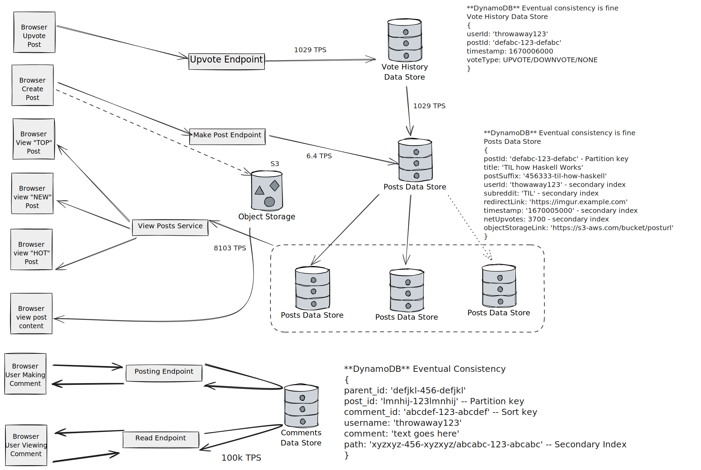

# DynamoDB-Lambda-React-Node (DLRN) Reddit-Style Application

A full-stack web application inspired by Reddit’s functionality, built with DynamoDB, Lambda, React, and Node (DLRN) to support efficient data fetching, scalability, and high performance in a serverless architecture.

## Architecture

## Table of Contents

- [Features](#features)
- [Highlights](#highlights)
- [Usage](#usage)
- [API Endpoints](#api-endpoints)
- [Database Design and Scalability](#database-design-and-scalability)
- [Pagination & Filtering](#pagination--filtering)
- [Performance Optimizations](#performance-optimizations)
- [Technologies](#technologies)
- [Future Plans](#future-plans)
- [Contributing](#contributing)
- [License](#license)

## Features

- **User Auth**: Users can authenticate using JWTs.
- **Subreddits**: Users can view and create subreddits.
- **Posts**: Users can post to specific subreddits.
- **Comments**: Users can comment on posts and other comments.
- **Voting**: Users can upvote and downvote posts and comments.
- **Filtering**: Users can sort posts and comments by "Hot," "New," and "Top."

## Highlights

- **Serverless Microservice Architecture**: Built on AWS Lambda, each endpoint is an independently scalable function. Lambda’s pay-as-you-go model reduces costs, and each function scales automatically based on load, ensuring a reliable and cost-efficient solution.
- **Efficient Data Fetching**: Uses `Promise.all` to handle multiple asynchronous queries for posts and comments, reducing overall load time.
- **Precomputed Post & Comment Ranking**: Implements precomputed ranking scores (`rankingScore`, `netUpvotes`) to sort content efficiently based on "Hot," "New," and "Top" filters.
- **Database Throughput**: The application is designed to handle heavy read/write loads and supports the following throughput:
  - **8,000+ Transactions per Second (TPS)** for reads (screen views)
  - **5,500+ TPS** for page views
  - **1,000+ TPS** for upvotes
  - **10+ TPS** for post creation
  - A DynamoDB is employed to distribute data across tables (Posts/Subreddits, Votes, Comments, Users), ensuring scalability and fault tolerance.
- **Caching with Redis**: Implemented Redis LRU caching strategy for frequently accessed data (e.g., hot posts and comments) to further reduce load times and optimize performance.
- **Precomputed Comment Fetching**: Server-side logic precomputes the path to child replies avoiding a recursive N+1 query allowing child replies to be fetched via regular expression
- **Reusability**: Frontend components such as the `PaginatedList` can handle paginated views of different data (posts, comments, replies) for scalability.

## Usage

The application supports Reddit-like functionality, including:

- Viewing, posting, and voting on posts.
- Threaded commenting with replies.
- Pagination and filtering of posts and comments, ranked using a custom algorithm for "Hot," "New," and "Top."

## API Endpoints

| Method | Endpoint                    | Description                                       |
| ------ | --------------------------- | ------------------------------------------------- |
| GET    | `/api/posts`                | Fetch all posts (supports pagination & filtering) |
| POST   | `/api/posts`                | Creates a new post                                |
| GET    | `/api/comments`             | Fetch top-level comments with pagination          |
| POST   | `/api/comments`             | Creates a new comment                             |
| GET    | `/api/comments/:id/replies` | Fetch replies to a specific comment               |
| POST   | `/api/votes`                | Creates a vote on a comment or post               |

## Database Design and Scalability

### Current Setup

The application currently uses a single MongoDB cluster managed by MongoDB Atlas with the following collections:

- **Users**
- **Posts**
- **Subreddits**
- **Comments**
- **Votes**

### Sharding Strategy

To prepare for scalability, I’m utilizing DynamoDB which is built to handle millions of TPS and is great for high read volume because it uses B-trees. For the traffic and workload outlined, sharding is effective for distributing high read/write loads while minimizing operational complexity. Here’s the planned approach:

- **Posts & Subreddits**: Data will be sharded based on `subredditId` to balance the high volume of post reads and writes across nodes. To manage “hot” subreddits, a compound shard key such as `subredditId + createdAt` can help distribute load further.
- **Votes**: Vote data will be sharded by `postId`, providing efficient scaling and balancing, with 1,000+ TPS anticipated for votes. Sharding by `postId` helps manage high-throughput, read-heavy voting activity effectively.

- **Comments**: Sharded by `postId`, which ties comments to their respective posts and allows MongoDB to distribute load and support recursive growth in comment threads efficiently.

- **Users**: User data will be stored and sharded by `userId`, ensuring that user-related activities and queries remain fast and distributed across the cluster.

This design provides high scalability and avoids scatter-gather while keeping the complexity and cost of management low. With DynamoDB's flexibility, this solution will allow the system to scale linearly as the user base grows, supporting efficient load distribution and isolating high-traffic features within the cluster through strategic sharding.

---

## Pagination & Filtering

The app supports several filtering and pagination strategies to optimize performance:

- **Posts**:
  - Posts can be filtered by `Hot`, `New`, and `Top` categories.
  - Pagination relies on DynamoDB lexigraphical sorting, using precomputed scores for ranking.
- **Comments**:
  - Paths for nested comments are precomputed upon creation allowing for efficient fetching of nested comments and avoiding a recursive N+1 fetch
  - Comments are paginated, with dynamic filtering for voting activity.

## Performance Optimizations

To ensure the app performs efficiently even with high traffic, the following optimizations have been incorporated:

- **Lambda-Optimized**:

  - Each endpoint operates independently with on-demand scaling, minimizing cold start times.
  - AWS Gateway facilitates seamless routing to Lambda functions.

- **Caching with Redis**:

  - Frequently accessed data, such as top posts and comments, is cached in Redis, improving response times on read-heavy operations.

- **Optimized Querying and Data Fetching**:

  - Utilized database triggers with DynamoDB streams and Lambda taskrunners to efficiently update multiple tables when users upvote and reply to posts
  - Precomputed comment paths, ranking scores, and net upvotes

- **Memoization**:

  - Using `useCallback` and `useMemo` to minimize unnecessary re-renders.
  - Leveraging Reselect’s `createSelector` to memoize `useSelector` calls in React.

- **Lazy Loading**:
  - Components are lazy-loaded with `React.lazy()` and `Suspense`, improving initial page load times and reducing bandwidth consumption.

## Technologies

- **DynamoDB**: Used for database management with a sharding strategy to optimize scalability across posts, comments, votes, and users.
- **Express**: Server framework for handling API requests and routing.
- **React**: Frontend library for building interactive user interfaces.
- **AWS Lambda**: Serverless microservices to handle API requests, routing, and autoscaling.
- **Redis**: Implemented as a caching layer to store frequently accessed data and reduce response times for read-heavy operations.
- **Dynamoose**: ORM for DynamoDB, used for schema definitions and query handling.
- **JWT (JSON Web Tokens)**: Used for secure authentication of users.

## Future Plans

- Implement user profiles with vote and post history.
- Expand validation and security features.
- Overhaul frontend design for a smoother, more intuitive experience.

## Spotted a bug?

If you find a bug, please open an issue [here](https://github.com/ckane30691/oldReddit/issues).
